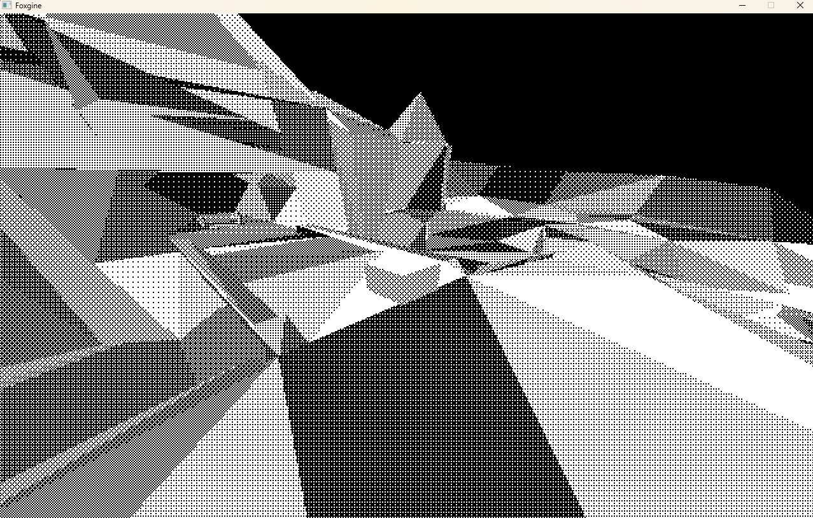

FYI: If there's anything you want to ask me about for this project, contacts are at the end!

Fully functioning 3D Engine made for low ended devices in C.

The engine is meant to target devices within specs of:
 - Playdate: https://help.play.date/hardware/the-specs/
 - Pocketbyte: https://pocketbyte.co
 - Swadge: https://swadge.com
 - Gameboy Advance ( W.I.P )
 - Thumby ( Downgraded version of Foxgine: https://github.com/PresentFoxz/Thumby-Emulator )

I've been building this for fun for the past year now over multiple git projects, and have finally gotten enough knowledge to create this one.

Images and Videos:

https://www.youtube.com/watch?v=mLkpq6KwXas ( Skip to 03:15 for my feature! )

I will try to have documents up eventually for how to actually create a game with Foxgine, but currently this is just a passion project I've been working on to get better at making Software as a whole!

Contacts: 
 - Gmail: vcapra75@gmail.com
 - Discord: presentfox
